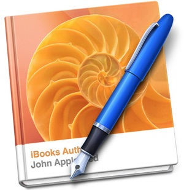
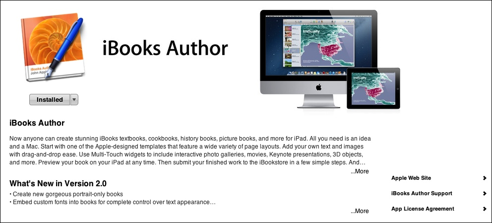
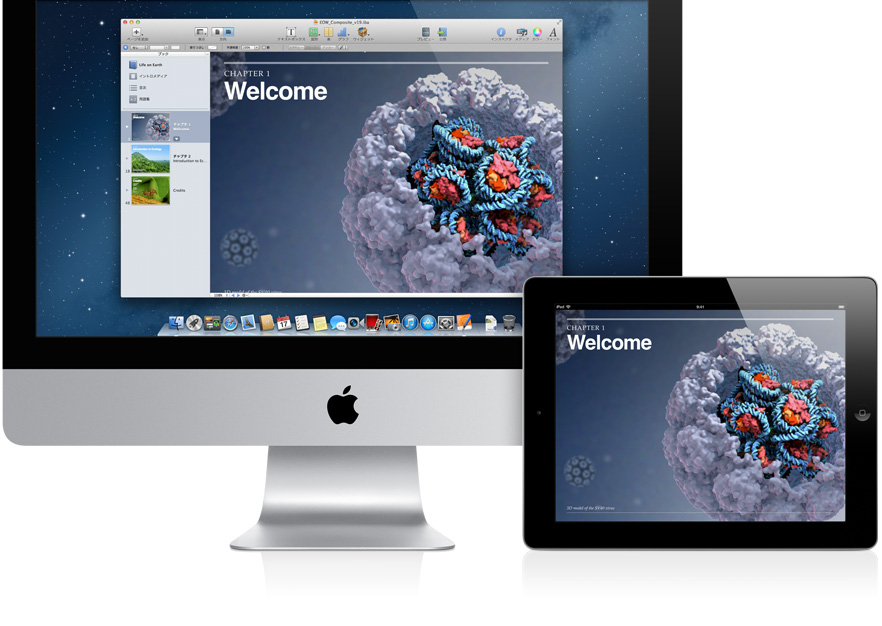

# 第1回 PBL科目 "iTamabi on iTunes U" について

今回は初回の授業ということで、まずこのワークショップ全体の目的、スケジュールなどについて説明します。また、この授業で製作に用いるアプリケーションである、iBooks Authorと、それを公開する仕組みiTunes Uについて解説します。

## このPBL科目の概要

この講義では、アップルが提供するオープン・エデュケーショナル・プラットフォームである「iTunes U」を用いて、多摩美から世界に向けて電子書籍を発信するプロジェクトベースの授業です。

昨年からアップルの規約が緩和され、誰でも自由に独自の講座を作成し、オンラインで配布することが可能になりました。また教材の作成手段として、iBooks Authorという専用アプリケーションが無料で配布されており、誰でも簡単にマルチタッチのタブレット端末の性能をフルに活用した高度な電子書籍を作成できるようになりました。

この授業では、PBL(プロジェクト・ベースド・ラーニング)科目として実際に多摩美発のiTuneUコンテンツを作成することを通して、次世代のオンライン・パブリッシング、オンライン・ラーニングのあり方について、体験を通して学んでいきます。

* 授業ページ: [iTamabi on iTunes U 2013 – iBooks Authorでつくるオープン・エデュケーショナル・プラットフォーム](http://yoppa.org/itunes13)

## 授業のスケジュール(予定)

* オリエンテーション、この授業で何をするのか?
* iBooks Authorの基礎 1 – 簡単な文書をつくってみる
* iBooks Authorの基礎 2 – テンプレート、テーマ、
* iBooks Authorの基礎 3 – 様々なメディアを使う、動画、音声
* iBooks Author応用 1 – インタラクティブな仕組みを作成、Widgetの使用
* iBooks Author応用 2 – 書籍の構成を整える、チャプタ、セクション、インデックス
* 中間発表、iTunesUで作成した書籍をプレゼン
* iTunes U Tamabiの構想、グループ分け、ディスカッション
* iTunesUでブックを公開する
* グループワーク
* 最終講評会にむけての準備
* 最終講評会

ただし、スケジュールは進行に応じて適宜変更する可能性もあります。

## iTunes Uとは?

Tunes Uとは、Appleが提供している、教育・学習向けのコンテンツ配信サービスとその専用アプリの名称です。

iTunes Uは、無償で提供されています。教育機関に所属していれば、iTunes Uを通じて、講義の様子やマルチメディアの資料といったコンテンツをポッドキャストの形式で容易に配信可能となります。配信対象は在学中の学生と関係者だけでなく、iTunes Storeを通じて広く一般に公開することもできます。

iTunes Uのサービスは2007年に開始され、iTunes StoreにもiTunes U専用の配信チャネルが開設されました。スタンフォード大学、UCLA(カリフォルニア大学バークレー校)、MIT(マサチューセッツ工科大学)などが当初から参加し、iTunes Uを通じて講義の映像を一般向けに配信しています。

2012年1月19日には、電子書籍リーダー「iBooks 2」、電子書籍のオーサリングソフト「iBooks Author」が発表され、マルチメディア教材の開発がとても簡単にできるようになりました。また、iTunes U専用のアプリケーションの提供も開始されています。

### 参考リンク

* [アップル - iTunes U - いつでも、どこでも、なんでも学ぼう](http://www.apple.com/jp/education/itunes-u/)
* [Apple - サポート - iTunes U](http://www.apple.com/jp/support/itunes-u/)

## iBooks Authorについて

iBooks Authorは、アップルの電子書籍アプリケーションです。iBooks Authorで作成されたドキュメントはPDF形式に保存できたり、iBooks形式で書き出して、iBooks Bookstoreで出版することが可能となります。アプリケーションは無料で提供されています。iBooks Authorで書き出したiBooksフォーマットは、iTunes Uで共有することもできるようになります。

### 参考リンク

* [アップル - iBooks Author](http://www.apple.com/jp/ibooks-author/)

iBooks Authorの紹介ビデオを観てみましょう。

* [iBooks Textbooks - Apple Education Event, January 2012 (Full Keynote)](http://www.youtube.com/watch?v=2fMZj2CdM4I)

## iBooks Authorのダウンロードとインストール

まずはじめに、Books Authorをインストールして本を作成してみましょう。

* [iBooks Authorダウンロード](https://itunes.apple.com/jp/app/ibooks-author/id490152466?ls=1&mt=12)

リンクを開くと、AppStoreが起動します。AppStoreのインストールボタンからアプリケーションをインストールしてください。

## ブック作成の手順

ブック作成の手順は以下のアップルのサポートを参考にして、おおまかな手順を理解しましょう。

[Appleサポート - iBooks Author: 作成手順の例](http://support.apple.com/kb/PH2743?viewlocale=ja_JP)より

「iBooks Author」を使ってブックを作成する手順の例を以下に紹介します。この例を参考に、自分のブックを作ってみましょう。必ずしもすべての手順を実行する必要はなく、ここに示されていないほかの手順を実行することもあります。実行順序も正確に以下の通りでなくてかまいません。たとえば、ブックのプレビューはいつでもできます。

### 手順 1：ブックの計画を立てる
始める前に、ブックをどのようにチャプタおよび セクション に分けて構成するか、どのようなメディアを使用するかなどを決めておくことをお勧めします。

### 手順 2：テンプレートを選択する
「iBooks Author」に付属の Apple がデザインした多数のテンプレートのいずれかを選択します。テンプレート は、iPad 上で縦 向き または横向きで表示するために最適化され、ブックを作成するために必要なものがすべて含まれています。統一感のある美しいデザインになるように、あらかじめフォント、色、表、グラフが組み合わされています。テンプレートを選択したら、好みに合わせてデザインを調整できます。

### 手順 3：コンテンツを追加する
テキストを記述したり、グラフィックスなどのオブジェクトを追加したり、ウィジェット（イメージ、ムービー、練習問題、3D オブジェクトなどのインタラクティブメディア）を追加したりします。文章を作成しながら、コンテンツにスタイルを適用することでフォーマットが簡単になります。「iBooks Author」で写真のマスク（切り取り）と調整を行います。表を追加したりグラフを追加したりします。目次、図、セクションなどの要素は、書類内で自動的に番号が振られます。

### 手順 4：用語集のエントリーを作成する
ブックに用語集を含めたい場合は、定義を載せる単語を選び、各単語の定義を作成します。定義にはテキストやイメージ、グラフィックスを追加できます。

### 手順 5：ブックをプレビューする
iPad 上でプレビューすることで、作業中（公開前）に読者と同じようにブックを見ることができます。

### 手順 6：ブックを共有する
完成したブックを、iBookstore に送信して公開したり、書き出して自分で配布したりします。

## 実習：iBooks Authorで自己紹介

「習うより慣れろ」ということで、実際にiBooks Authorで文書を作成してみましょう。次週までの課題とします。

### テーマ「自己紹介」

* 既存のテンプレートを活用して、自己紹介の簡単なブックを作成してください。
* 2ページ程度
* できれば、写真やイラストなどを活用して、楽しいデザインに!
* さらに余裕がある方は、動画や音声などが貼りつけられないかトライしてみる。

#### 参考リンク
[Apple - サポート - iBooks Author](http://www.apple.com/jp/support/ibooksauthor/)

