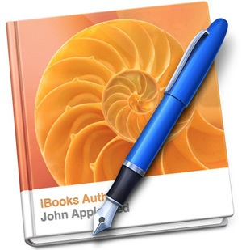

# iBooks Authorの基礎 1 – 簡単な文書をつくってみる

## 今日の内容: 自己紹介のブックを作成する!

今日からいよいよ具体的にiBooks Authorをつかって実際にブックを作成していきましょう。今回は簡単な文書ということで、自己紹介のブックを作成していきます。

## iBooks Authorを体感する

iBooks Authorでは様々なメディアをブックにとりこむことが可能です。

* Keynoteのプレゼンテーション
* インタラクティブなイメージ
* インタラクティブなギャラリー
* サイドバー
* ポップアップメニュー
* 動画
* クイズ
* 3Dオブジェクト
* HTML埋め込みモジュール

まず本を作成する前に、実際にiBooksのブックではどのようなことができるのかサンプルを見ながら実感してみましょう。

[Apple - Education - iBooks Author Gallery](http://www.apple.com/education/ibooks-textbooks/gallery.html)

## iBooks Author ブックの構成要素

iBooksでは、完成される書類(本)をブックと呼んでいます。1冊のブックは、様々な要素から構成されています。まずはブックの構成要素について整理して理解しましょう。

「[アップルサポート - iBooks Author: ブック要素の概要](http://support.apple.com/kb/PH2748?viewlocale=ja_JP)」より

#### ブックタイトル

iBookstoreと読者のiBooksブックシェルフに表示される表紙。ブックのタイトルを追加するには、プレースホルダテキストを上書きします。

#### イントロメディア

読者が iPad でブックを開いたときに表示するイメージまたは短いビデオ（推奨 10 秒以内）を追加します。ブックの目次が直接開くようにするには、「イントロメディア」を空のままにします。

#### 目次

完成したブックの読者は、目次を使って特定の場所に移動できます。「iBooks Author」では、目次が自動的に作成およびアップデートされます。好みに合わせて目次をカスタマイズすることもできます。

#### 用語集

ブック全体に用語を追加して、読者がタップすると定義を参照できるようにします。定義された用語はすべて用語集にも表示されます。用語を追加しなければ、用語集は作成されません（テンプレート自体から用語集を削除することはできません）。

#### チャプタとセクション

チャプタにはページを含めることができ、ページで構成されるセクションを含めることもできます。たとえば、ほ乳類に関するブックに「クマ」というチャプタを作り、それに「ホッキョクグマ」、「ハイイログマ」などのセクションを含めることができます。レッスン、アクティビティ、事例研究など、チャプタ内の自己完結的な内容を提供するためにセクションを使用することもできます。

## iBooks Author ブック作成の手順

まず初めに、iBooks Authorでのブック作成の大まかな手順を把握しましょう。必ずしもすべての手順を実行する必要はなく、ここに示されていないほかの手順を実行することもあります。実行順序も正確に以下の通りでなくてかまいません。

[アップルサポート - 「iBooks Author: 作成手順の例」より](http://support.apple.com/kb/PH2743?viewlocale=ja_JP)

#### 手順 1：ブックの計画を立てる

始める前に、ブックをどのようにチャプタおよびセクションに分けて構成するか、どのようなメディアを使用するかなどを決める。

#### 手順 2：テンプレートを選択する

「iBooks Author」に付属の Apple がデザインした多数のテンプレートのいずれかを選択します。テンプレート は、iPad 上で縦 向き または横向きで表示するために最適化され、ブックを作成するために必要なものがすべて含まれています。統一感のある美しいデザインになるように、あらかじめフォント、色、表、グラフが組み合わされています。テンプレートを選択したら、好みに合わせてデザインを調整できます。

#### 手順 3：コンテンツを追加する

テキストを記述したり、グラフィックスなどのオブジェクトを追加したり、ウィジェット（イメージ、ムービー、練習問題、3D オブジェクトなどのインタラクティブメディア）を追加したりします。文章を作成しながら、コンテンツにスタイルを適用することでフォーマットが簡単になります。「iBooks Author」で写真のマスク（切り取り）と調整を行います。表を追加したりグラフを追加したりします。目次、図、セクションなどの要素は、書類内で自動的に番号が振られます。

#### 手順 4：用語集のエントリーを作成する

ブックに用語集を含めたい場合は、定義を載せる単語を選び、各単語の定義を作成します。定義にはテキストやイメージ、グラフィックスを追加できます。

#### 手順 5：ブックをプレビューする

iPad 上でプレビューすることで、作業中（公開前）に読者と同じようにブックを見ることができます。

#### 手順 6：ブックを共有する

完成したブックを、iBookstore に送信して公開したり、書き出して自分で配布したりします。

## 実習：「自己紹介」ブックを作成してみる!

今日のエクササイス「自己紹介」ブックを作成してみましょう!

自分の魅力が伝わるようブックを工夫してみましょう。来週に簡単にプレゼンをしてもらいます。

### ブックの計画

* ブックの構成を考える
* このブックで自分の何をアピールするのか
* どんなイメージの本にするのか

### 必要となる材料を集める

* タイトルのグラフィック
* 本文で使用する写真やイラストなど
* Keyノートのプレゼンテーション
* 写真ギャラリー
* もし作成できる人は、イントロメディアに載せる動画素材

…etc.
