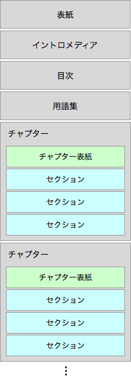

# グループワーク iTamabiブック企画会議

今回は前回の作成したグループに分かれてブック(iBooks Authorで作成する本)の企画についてグループごとに話し合いをします。この時間内に以下の内容を決めて、グループで1つオンラインの企画書案フォームに記入してください。

また、先週欠席していて、まだどこのグループに所属するか(もしくは個人でやるか)を決定していない方は、この時間内に所属するプロジェクトを確定してください。	

## iTamabi ブック企画書

* ブックのタイトル: 例「多摩美教授図鑑」
* 内容の要約(200文字程度)
* 本の構成(表紙、イントロメディア、チャプター、セクション)
* 必要となるメディア
* 役割分担(グループの場合)

グループで話し合って、企画が決まったら下記のオンラインフォームに記入して提出してください。

* [iTamabiブック企画書](https://docs.google.com/forms/d/1vRCERdJmdLcp61m3KntqXUbm74JCQe-phBxxF9e36lw/viewform)

## 参考: iBooks Authorでつくるブックの基本構成

iBooks Authorで作成するブック(本)は、大きな構成はあらかじめ決められています。大きな構造として、まず「表紙」から始まり、「イントロメディア」「目次」「用語集」と続きます。その後で書籍の本体が「チャプター」という単位でまとめられていきます。各「チャプター」の中は「チャプターの表紙」「セクション1」「セクション2」「セクション3」… というように続いていきます。このチャプターが1単位となって「チャプター1」「チャプター2」「チャプター3」… と増えていくというのが基本構造です。

この構成の中にどのようにして企画の内容を盛り込むか、またそれぞれの項目でどのようなメディアが必要となるのかを考えていきましょう。

