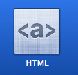
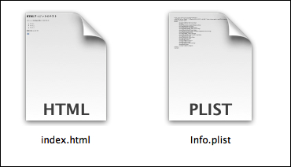
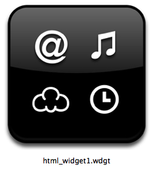
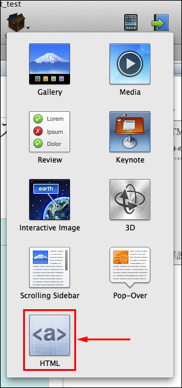
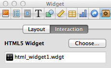
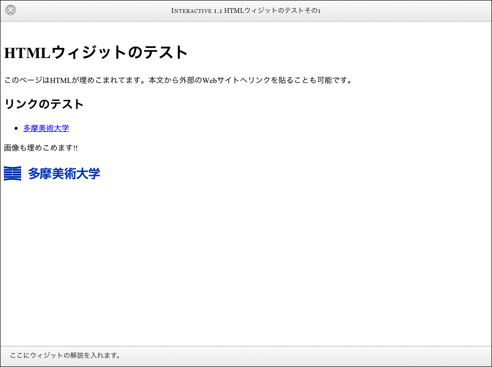
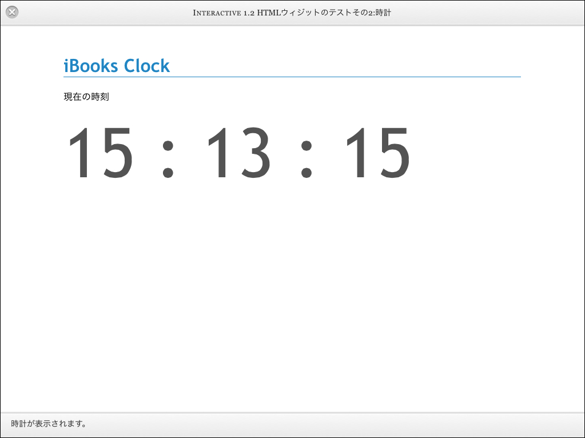
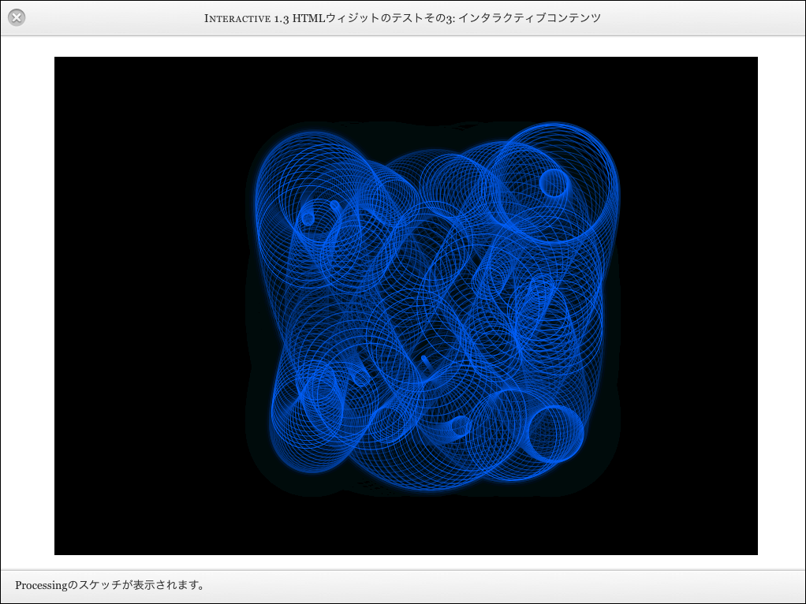

# iBooks Author応用: HTMLウィジットを使う

## サンプルファイルのダウンロード

以下の解説で使用したサンプルは、下記からダウンロードしてください。

* [サンプルファイルダウンロード(Google Driveにリンク)](https://docs.google.com/file/d/0BzyVHU69QO3mM29NRS1NbTFtczQ/edit?usp=sharing)

## HTMLウィジットとは

iBooks Authorに「HTMLウィジット」を使用することで、ブックの中にHTMLを埋めこむことが可能となります。この手法を応用すると、自分で作成したHTML5+JavaScriptのプログラムを組み合わせて、よりインタラクティブな電子書籍を作成することが可能となります。

HTMLウィジットには以下の要素が含まれています。

* メイン HTML ファイル：このファイルはウィジェットの主要部分です。ファイル名には任意の名前を付けられますが、拡張子は必ず「.html」にします。CSS や JavaScript をこのメイン HTML ファイルに入れることができます。または、.css ファイルと .js ファイルをウィジェットのバンドルとしてメイン HTML ファイルとのセットにして読み込むこともできます。これらのファイルには、ウィジェットをデザインする際に使えるテクニックやトリックを使用できます。一般的には、HTML でウィジェットの構成を定義して CSS でビジュアルスタイルを提供し、JavaScript でインタラクティビティをサポートします。
* Default.png：これはページに表示される画像で、ユーザがウィジェットを開くためにこれをタップします。ファイル名は必ず、大文字の「D」で「Default.png」とします。Default.png を作成するもっとも簡単な方法として、Web コンテンツ作成 App または Web ブラウザで表示しているメイン HTML ファイルのスクリーンショットを録ります。ウィジェットがアクティブなときに、Info.plist で指定しない限りこの画像は、Default.png の実際のサイズになります。
* Info.plist：このファイルは、ウィジェット実行に必要な情報を iBooks Author と iBooks に提供します。ファイル名は必ず「Info.plist」とします。

## シンプルなHTMLを貼り付けてみる

まずはシンプルなHTMLをウィジットとして貼りつけてみましょう。下記のようにプレーンなHTML書類を作成し、index.htmlという名前で、新規に作成したフォルダ内に保存してください。フォルダの名前は任意のもので構いませんが、例えば「html_widget1」としてみます。

	<!doctype html>
	<html>
	<head>
		<meta charset="utf-8">
		<meta name="viewport" content="width=device-width, initial-scale=1.0, user-scalable=yes">
		<title>HTMLウィジットのテスト</title>
	</head>
	<body>
		<h1>HTMLウィジットのテスト</h1>
		
このページはHTMLが埋めこまれてます。本文から外部のWebサイトへリンクを貼ることも可能です。

		<h2>リンクのテスト</h2>
		<ul>
			<li><a href="http://www.tamabi.ac.jp/index_j.htm">多摩美術大学</a></li>
		</ul>
		
画像も埋めこめます!!

		

	</body>
	</html>

このフォルダに下記のファイルを作成し「Info.plist」という名前でindex.htmlと同じ場所に保存します。

	<?xml version="1.0" encoding="UTF-8"?>
	<!DOCTYPE plist PUBLIC "-//Apple//DTD PLIST 1.0//EN" "http://www.apple.com/DTDs/PropertyList-1.0.dtd">
	<plist version="1.0">
	<dict>
		<key>AllowNetworkAccess</key>
		<true/>
		<key>CFBundleDevelopmentRegion</key>
		<string>English</string>
		<key>CFBundleDisplayName</key>
		<string>HTML Widget Test 1</string>
		<key>CFBundleIdentifier</key>
		<string>jp.ac.idd.tamabi.itamabi.widgetTest1</string>
		<key>CFBundleName</key>
		<string>widget_test</string>
		<key>CFBundleShortVersionString</key>
		<string>1.0</string>
		<key>CFBundleVersion</key>
		<string>1.0</string>
		<key>Height</key>
		<integer>640</integer>
		<key>MainHTML</key>
		<string>index.html</string>
		<key>Width</key>
		<integer>1024</integer>
	</dict>
	</plist>

新規に作成した「html_widget1」フォルダ内は、以下のようにindex.htmlとinfo.plistの2つのファイルが入った状態となります。

フォルダの内容を確認したら、このフォルダの名称を「html_widget1.wdgt」と変更します。すると自動的にフォルダから「ウィジット」という形式に変化して、ファインダー上に表示されます。

ここまで出来たら、iBooks Authorを起動します。ウィジットを貼りつけたい場所へ移動して、ウィジットメニューからHTMLウィジットを選択して貼り付けます。

ウィジットを選択した状態で「インスペクタ」ボタンを推してインスペクタを表示して「選択」ボタンを押します。するとファイルダイアログが表示されるので、先程作成した「html_widget1.wdgt」を選択します。

この状態で、iPadでプレビューしてみましょう。作成したHTMLがiBooks内で表示されるはずです。

## JavaScriptとの組み合わせ1: 時計ウィジット

ウィジットにはHTMLだけでなく、CSSやJavaScriptを埋めこむことも可能です。例えば、下記のサンプルは現在時刻をJavascirptで取得して表示するサンプルです。

先程と同じようなやりかたで、ウィジット用のフォルダを用意して、HTMLファイルを以下のように変更します。info.plistはそのままで構いません。

	<!doctype html>
	<html>
	<head>
		<meta charset="utf-8">
		<title>時計</title>
		
	</head>
	<body>
		<h1>iBooks Clock</h1>
		
現在の時刻

		<output id="time">00:00:00</output>
		
	</body>
	</html>

このフォルダも拡張子「.wdgt」の形式にしてウィジット化します。そのウィジットを先程と同じようにiBooks Authorを使用してブック内に貼りこむと以下のように時計が表示されるでしょう。

	

## Processing.jsで、さらに高度なインタラクション

最後により高度なインタラクティブなコンテンツをiBooksに埋めこんでみましょう。HTML+Javascriptで記述されたページであれば、基本的にはHTMLウィジット化することが可能です。例えば、[Processing](http://processing.org/)という開発環境も、最近ではJavascriptモードで書き出すことが可能となったので、そのままHTMLウィジットにすることが可能です。

まずProcessingのコンテンツを表示するためのテンプレートをダウンロードしてください。

* [https://github.com/tado/iBooks_widget_for_p5](https://github.com/tado/iBooks_widget_for_p5)

このファイルを展開し、中にあるsketch.pdeをProcessing.appから編集します。例えば、以下のようなインタラクションを加えたプログラムにしてみましょう。

	int NUM = 32;
	float[] x = new float[NUM];
	float[] y = new float[NUM];
	float phase, speed, radius, ratio;
	
	void setup() {
	  size(960, 640);
	  frameRate(30);
	  background(0);
	  speed = 3.0;
	  radius = height/4.0;
	  ratio = 1.33;
	}
	
	void draw() {
	  if (mousePressed) {
	    ratio = float(mouseX) / float(mouseY);
	  }
	  fade();
	  translate(width/2, height/2);
	  phase += speed;
	  for (int i = 0; i < NUM; i++) {
	    x[i] = cos(radians(phase) / NUM * (i + 1)) * radius;
	    y[i] = sin(radians(phase) / NUM * (i + 1) * ratio) * radius;
	    noFill();
	    stroke(0, 127, 255);
	    ellipse(x[i], y[i], radius/float(NUM) * i, radius/float(NUM) * i);
	  }
	}
	
	void fade() {
	  noStroke();
	  fill(0, 10);
	  rect(0, 0, width, height);
	}
	
このフォルダの拡張子を「.wdgt」	に変更してウィジット化し、iBooks Authorでブックに張り込みます。すると以下のようにインタラクティブにアニメーションするページが表示されます。

	

この手法をつかうことで、高度なインタラクティブなコンテンツや、生成的なコンテンツをiBooksに埋め込むことも可能となるでしょう。工夫次第で非常に大きな可能性を秘めた機能といえるのではないでしょうか。
